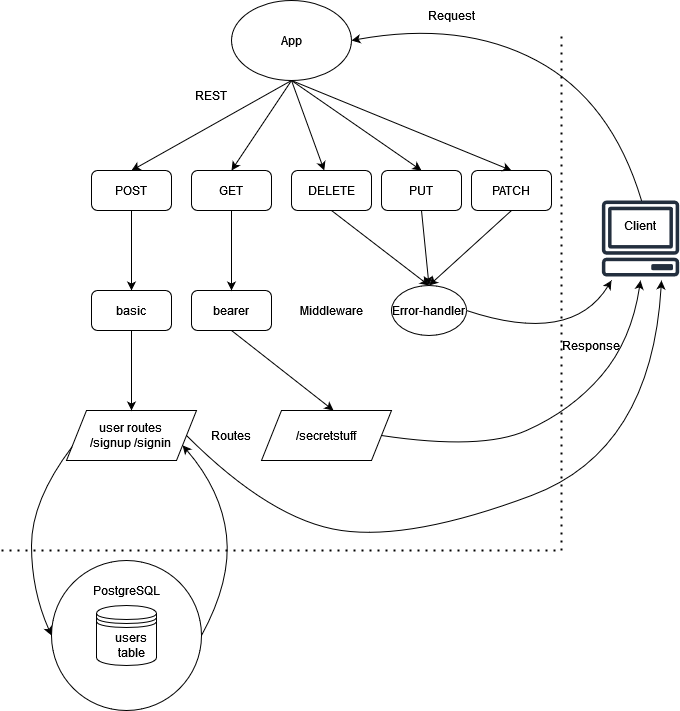

# bearer-auth

## Installation

  clone repo, and then in a terminal run the 'npm i' command while in the root directory to install dependencies.
  
  To run the application, enter the 'npm run start' command in a terminal while in the root directory.

## Summary of Problem Domain

  Create an auth application. Application requirements are as follows:
  
  Phase 1 requirements:

    Users will be able to create an account that will persist for future app visits

    Registered users will be able to login to their account so that they may access protected information

    App will have Proper CI/CD configuration

  Phase 2 requirements:

    A user will be able to obtain a token after they sign in, so that they can re-authenticated when certain actions are taken

    App shall have a route that only user with a valid token can use

    The JWT used in the application will be secured by 1+ methods

## Links to application deployment

  App deployed on Heroku [here]()

  Pull req from dev found [here](https://github.com/Beers15/bearer-auth/pull/1)

## Uml Diagram

## Routes

* REST Method GET

  * Path: /secret
    * Sends a request with an "Authorization" header with the value Bearer TOKEN that contains a properly encoded JWT
    * returns a secret message if the user is properly validated

* REST Method POST
  * Path: /signin
    * Sends a request with an "Authorization" header with the value Basic TOKEN that contains a properly encoded username and password combination
    * returns the user's data and a JWT token as output after account creation, or a proper error response if the request wasn't successful

* REST Method POST
  * Path: /signup
    * takes a JSON obj or form data as input with user and password information
    * returns the user's data and a JWT token as output after a successful login attempt, or a proper error response if the request wasn't successful
